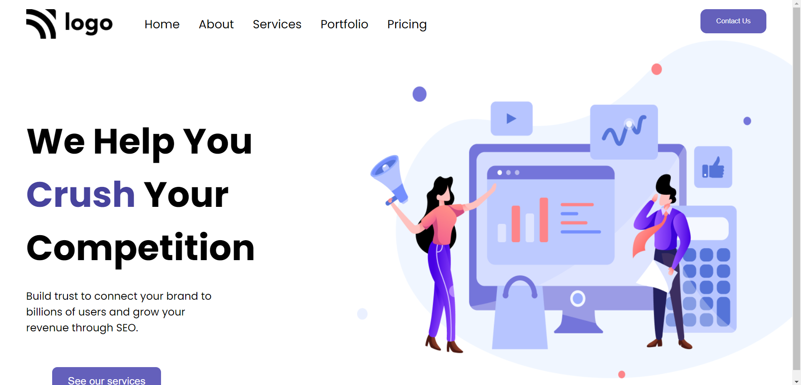

# Hey Welcome

Hi, My name is Uvesh Khatri and I have completed the 4th Project of the iNeuron Full Stack Course.

# Project 4

In this project i have created a Digital Marketing Home Page. And i have learnt a lot of things like Position.

It took me 6  Hours to complete this project
## Tech Stack Used 
- HTML5

- CSS

## My Project is looking like :

[Live Link](https://uveshkhatri-digitalmarketing-homepage.netlify.app/)